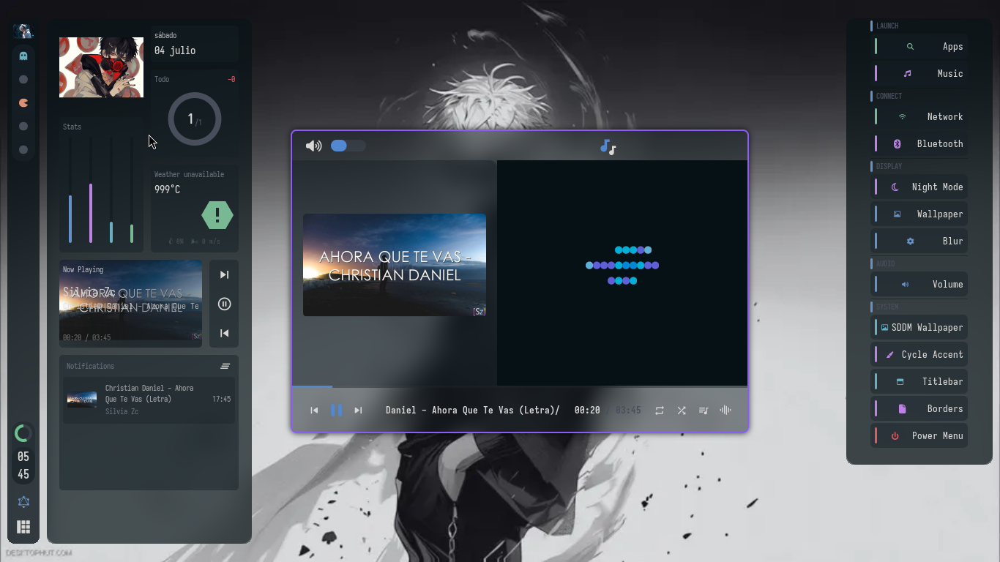
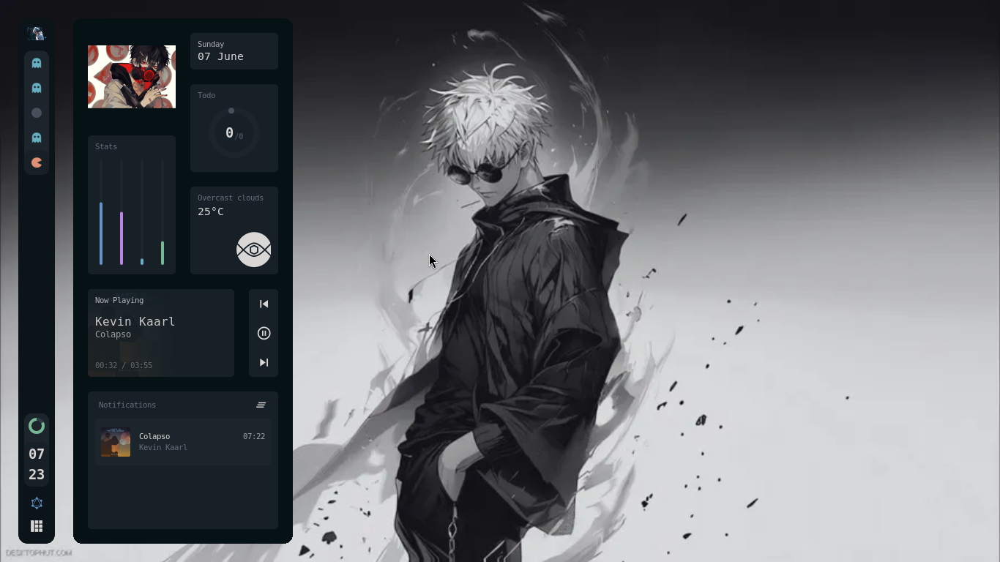

<div align="center">
  
</div>

<br>

<div align="center">

[](https://github.com/fc4419039/awesome-rxyhn-remix/stargazers)
[](https://github.com/fc4419039/awesome-rxyhn-remix/blob/main/LICENSE)
[](https://awesomewm.org/)
[](https://archlinux.org/)
[](https://www.lua.org/)

</div>

<br>

<div align="center">
  
</div>

<br>

<h1 align="center">
  AwesomeWM Dotfiles — Modernized & Fixed Remix
</h1>

<p align="center">
  <i>Configuración completa de <b>AwesomeWM</b>, reparada, optimizada y extendida con funcionalidades modernas.</i>
  <br><br>
  Basado en el trabajo original de <b>rxyhn</b> (repositorio eliminado). Versión actualizada, sin errores, lista para producción.
</p>

<br>

<div align="center">
  <h2>Stack</h2>
  <p>
    
    
    
    
    
    
    
    
    
    
  </p>
</div>

<br>

## Vista previa

<p align="center">
  
  
  
</p>
<p align="center">
  
</p>

## Características

### Wibar
- Barra vertical en el lateral **izquierdo** (50px de ancho)
- **Taglist personalizado** con iconos Pac-Man (seleccionado), Fantasma (con ventanas) y Punto (vacío)
- **Arcchart de batería** con colores dinámicos (verde/amarillo/rojo) e indicador de carga
- **Reloj digital** hora/minuto apilados verticalmente
- **Lista de ventanas** con tooltip al hover mostrando título y clase
- Botón de **centro de notificaciones**
- **Layoutbox** para cambiar layouts
- Auto-ocultamiento al maximizar o pantalla completa
- Atajo `Ctrl+F` para ocultar/mostrar

### Dashboard
Panel deslizable desde la izquierda con:
- **Perfil** con foto de usuario
- **Música** con carátula, artista/título animado y barra de progreso
- **Controles multimedia** (anterior/reproducir/siguiente)
- **Reloj grande** de 12h
- **Fecha** (día y fecha completa)
- **Todo** con gráfico de arco y contador de pendientes
- **Clima** con icono, temperatura, descripción, humedad y viento (OpenWeatherMap)
- **Estadísticas** del sistema: volumen, brillo, CPU, RAM con tooltips
- **Notificaciones recientes** con lista scrolleable y botón de limpiar

### Panel de estadísticas (Stats Tooltip)
Panel desplegable al hacer clic en batería/reloj:
- **Reloj analógico** dibujado con Cairo
- **Batería** con iconos dinámicos según nivel
- **Uptime** del sistema
- **Gestor WiFi interactivo**:
  - Escaneo de redes
  - Lista ordenada por señal
  - Conexión con ingreso de contraseña
  - Indicador de red conectada

### Centro de notificaciones
- Lista de notificaciones recientes con icono, título, mensaje y timestamp
- Botón **No molestar** (persiste el estado, silencia sonidos)
- Botón **Limpiar todas**
- Scrolling con rueda del mouse
- Animación slide al abrir/cerrar

### Sistema de audio de notificaciones
- **Sink independiente** para notificaciones (no afecta volumen del sistema)
- **Sonido al capturar pantalla** (Insert/Alt+Insert) con `pw-play` sobre el sink de notificaciones
- **Router automático** de streams de notificación hacia el sink aislado
- **Volumen de notificaciones** ajustable independientemente desde `volumen` (`Super+v`)
- **Loopback** de notificaciones al sink por defecto con latencia mínima (25ms)
- **Do-Not-Disturb** silencia completamente los sonidos de notificación

### Rofi menus
- **Launcher** (`Super+d`) — centrado, estética gamer con bordes púrpura `#7c3aed` y selección cyan `#06b6d4`
- **WiFi** (`Super+Shift+w`) — con buscador, `network.sh` mejorado con `mktemp`, parsing robusto de SSID y detección de errores
- **Bluetooth** (`Super+b`) — `bluetooth.sh` reescrito con funciones separadas, extracción de MAC corregida y estructura de loops mejorada
- **Power** (`Alt+F4`) — menú de apagado/reinicio/bloqueo/suspensión
- **Volumen** (`Super+v`) — ventana GTK3 con sliders por aplicación, sink de notificaciones aislado, CSS con temática gamer
- **Cycle accent** (`Ctrl+Super+b`) — cambia el color de acento (bordes + rofi) entre 12 colores sin recargar configuración

### Decoraciones de ventana

**Barra de título estándar:**
- Botones redondos: cerrar (rojo), maximizar (amarillo), flotar (púrpura)
- Widgets de info: WiFi, IP pública, VPN
- Título de la ventana centrado
- **Borde de ventana** de 2px del mismo color que los menús rofi, cambiable con `Ctrl+Super+b`
- **Bordes y titlebars activados por defecto.** Para desactivarlos:
  - `Ctrl+Super+Shift+B` — quita/pone los bordes de las ventanas (rofi no se afecta)
  - `Ctrl+Super+Shift+T` — quita/pone la barra de título completa
- Ambos toggles persisten entre recargas de Awesome

**Reproductor de música (ventanas ncmpcpp):**
- Barra de título reemplazada por reproductor completo
- Carátula del álbum
- Barra de progreso interactiva (click para seek)
- Controles: anterior, play/pausa, siguiente
- Botones: loop, shuffle, playlist, visualizador
- Texto animado de canción actual
- Volumen ajustable

### MSCDown — Music Searcher & Downloader
Buscador y descargador de música desde YouTube con menú interactivo y modo directo:
- **Instalación automática** con el dotfiles o manual desde `mscdown/install.sh`
- **Menú interactivo** con selección estilo questionary (`musica`)
- **Modo directo**: `musica Queen Bohemian Rhapsody`
- **Sincronización automática con MPD** (opcional, configurable en `mscdown/settings.conf`)
- **Metadatos y miniaturas** embebidos (título, artista, carátula)
- **Calidad ajustable**: 320/192/128 kbps, formato mp3/m4a/ogg/wav
- **Entorno virtual aislado** con venv, sin dependencias globales
- Repositorio: [`fc4419039/mscdown`](https://github.com/fc4419039/mscdown)

### Lock Screen
- Pantalla de bloqueo con **autenticación PAM**
- **Word clock** en inglés (ej. "IT IS HALF PAST TEN")
- Controles de música con carátula
- Animación de arcoíris en cada tecla
- Atajo: `Mod+Ctrl+L`

### Window Switcher (Alt+Tab)
- Thumbnails en vivo de las ventanas
- Navegación con teclado (Tab/arrows)
- Minimizar/matar ventanas desde el switcher
- Auto-ocultamiento al soltar Alt

### Tag Preview
- Vista previa del contenido del tag al hoverear sobre el taglist
- Posicionado automático en la pantalla correcta

### Gestión de pantallas
- Soporte **multi-monitor** completo
- Wibar, dashboard, stats tooltip y centro de notificaciones independientes por pantalla
- Tags independientes por monitor
- Navegación entre pantallas: `Mod+Ctrl+j/k`
- Mover cliente a otra pantalla: `Mod+o`

### Señales del sistema monitoreadas

| Señal | Descripción |
|---|---|
| Batería | Porcentaje y estado de carga (c/30s) |
| Volumen | Porcentaje y mute (eventos pactl) |
| Brillo | Porcentaje (eventos inotify) |
| CPU | Uso porcentual (c/5s) |
| RAM | Usada/total (c/20s) |
| Uptime | Tiempo encendido (c/60s) |
| Clima | OpenWeatherMap (c/1200s) |
| Todo | Progreso de tareas (eventos inotify) |
| Red | Estado y SSID (c/30s) |
| Playerctl | Metadatos, estado y posición musical |

### Layouts disponibles
- **Tile** (predeterminado)
- **Floating**
- **Centered** (bling)
- **MSTab** (bling)
- **Horizontal** (bling)
- **Machi** (layout manual con editor interactivo)
- **Equalarea** (bling)
- **Deck** (bling)

### Atajos de teclado principales

| Tecla | Acción |
|---|---|
| `Mod+Enter` | Terminal (kitty) |
| `Mod+d` | Rofi (lanzador) |
| `Mod+Shift+d` | Dashboard |
| `Mod+w` | Navegador web |
| `Mod+Shift+w` | Menú de redes |
| `Mod+b` | Menú Bluetooth |
| `Mod+v` | Control de volumen GTK (volumen) |
| `Alt+F4` | Menú de apagado |
| `Insert` | Captura de pantalla completa con sonido |
| `Alt+Insert` | Captura de área al portapapeles con sonido |
| `Mod+z` | Scratchpad |
| `Mod+Shift+n` | ncmpcpp |
| `Mod+Ctrl+l` | Lock screen |
| `Ctrl+Super+b` | Cambiar color de acento (bordes + rofi) |
| `Ctrl+Super+Shift+B` | Quitar/poner bordes de ventanas (activos por defecto) |
| `Ctrl+Super+Shift+T` | Quitar/poner titlebars (activas por defecto) |
| `Alt+Tab` | Window switcher |
| `Mod+q` | Cerrar ventana |
| `Mod+f` | Thunar |
| `Mod+o` | Mover a otra pantalla |
| `Mod+Ctrl+j/k` | Navegar entre pantallas |
| `Ctrl+F` | Ocultar/mostrar wibar |
| `Mod+c` | Centrar ventana (doble: centrar+flotar+redimensionar) |
| `Mod+[1-5]` | Cambiar tag |
| `Mod+Shift+[1-5]` | Mover ventana a tag |
| `Mod+Arrow` | Foco direccional |
| `Mod+Shift+Arrow` | Intercambiar direccional |
| `Mod+s` | Layout tile |
| `Mod+Shift+s` | Layout floating |
| `Mod+Space` | Siguiente layout |
| `Mod+=/-` | Ajustar useless gap |
| `Mod+Shift+=/-` | Ajustar padding |
| `Insert` | Captura de pantalla completa |
| `Alt+Insert` | Captura de área (portapapeles) |
| `Alt+a/s/d` | Agrupar/iterar/desagrupar pestañas |

### MSCDown — Music Searcher & Downloader
Buscador y descargador de música desde YouTube con menú interactivo y modo directo:
- **Detección automática** del gestor de paquetes (apt/pacman/dnf)
- **Modo interactivo** con menú de selección (`musica`)
- **Modo directo**: `musica Queen Bohemian Rhapsody`
- **Sincronización automática con MPD** (opcional)
- **Metadatos y miniaturas** embebidos en los archivos
- **Entorno virtual aislado** con venv, sin ensuciar el sistema
- Se instala junto con el dotfiles o manualmente desde `mscdown/install.sh`

### Extras
- **Sloppy focus** — el foco sigue al mouse
- **Flash focus** — destello al cambiar foco
- **Menú contextual** en click derecho del escritorio con submenú **"Fondos"** que incluye:
  - **Fondo interactivo** — cambia el wallpaper automáticamente de forma aleatoria desde `~/fondos/` en cada recarga o rotación programada
  - **Elegir imagen** — selector gráfico (`yad`) para escoger una imagen específica de `~/fondos/` y fijarla manualmente (persiste entre cambios automáticos)
  - **Pantalla de bloqueo** — establece la imagen de fondo del lock screen SDDM
- **Scratchpad** terminal flotante (Mod+z)
- **Window swallowing** — las terminales son reemplazadas por apps lanzadas
- **Save floats** — preserva posición de ventanas flotantes al cambiar tags
- **Better resize** — redimensionado mejorado para tiled
- **Esquinas redondeadas** en ventanas
- **Notificaciones OSD** para volumen/brillo con barra de progreso
- **Selector de layouts** con vista previa de iconos
- **Scripts**: cambio de fondo dinámico, gestor de red, Bluetooth, power menu
- **Lock screen**: usa PAM con `liblua_pam.so` compilado para Arch Linux x86_64. Si usas otra distro/arquitectura, recompílalo desde `ui/lockscreen/lib/`
- **OpenCode**: agente de IA configurado listo para usar (`opencode.json` incluido)

<details>
<summary><strong>Instalación</strong></summary>

### Instalación automática

```bash
git clone --recurse-submodules https://github.com/fc4419039/awesome-rxyhn-remix.git
cd awesome-rxyhn-remix
chmod +x install.sh
./install.sh
```

> ⚠️ El script requiere `sudo` solo para instalar el tema SDDM.

### Instalación manual

1. **Dependencias** (Arch Linux):

```bash
yay -Sy awesome-git picom-git kitty rofi todo-bin acpi acpid \
wireless_tools jq inotify-tools polkit-gnome xdotool xclip maim \
brightnessctl alsa-utils alsa-tools pipewire pipewire-pulse wireplumber \
playerctl feh zsh neovim btop lsd bat python-gobject pipewire-alsa --needed
```

2. **Fuentes**: Iosevka Nerd Font, Material Design Icons, Weather Icons + fuentes icomoon incluidas en `fonts/`

3. **Copiar config**:

```bash
cp -r config/* ~/.config/
cp -r bin/* ~/.local/bin/
```

4. Configurar `openweathermap_key` y `openweathermap_city_id` en `rc.lua`

5. Colocar wallpapers en `~/fondos/`

6. Cerrar sesión e iniciar AwesomeWM

</details>

<details>
<summary><strong>Créditos</strong></summary>

- **rxyhn** — Diseño original
- **s4vitar** — Configuración de zsh
- **ner0z** — Colorscheme night
- **ChocolateBread799**, **JavaCafe01** — Contribuciones originales

</details>

<br>

<div align="center">
  <i>⭐ Si este dotfiles te fue útil, ¡deja una estrella! Me ayuda a seguir mejorándolo. 🫶</i>
  <br><br>

  [](https://github.com/fc4419039/awesome-rxyhn-remix/stargazers)
  [](https://github.com/fc4419039/awesome-rxyhn-remix/blob/main/LICENSE)

</div>
