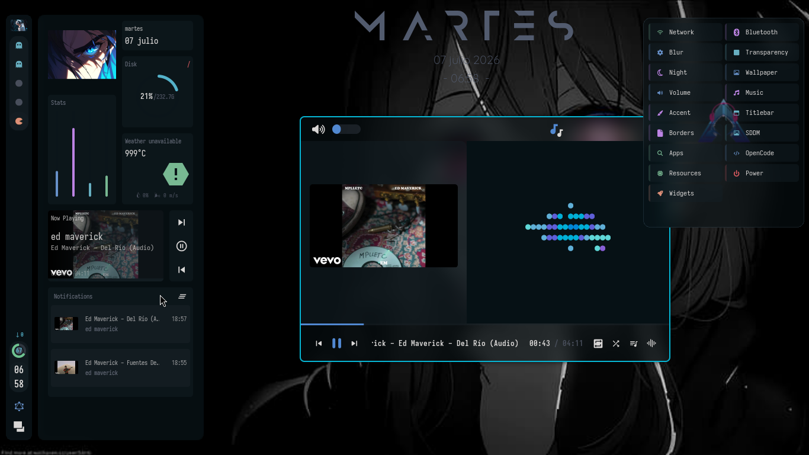
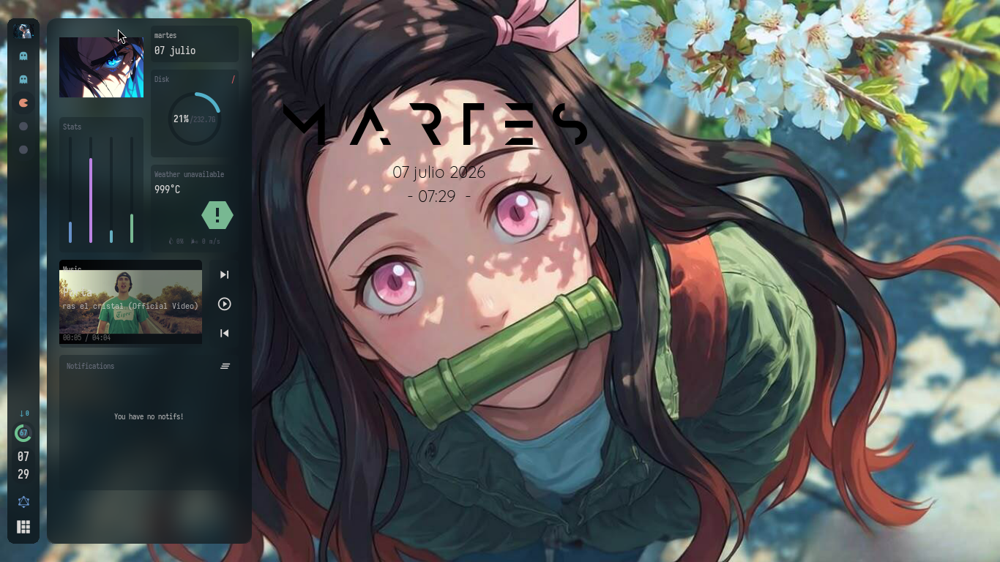
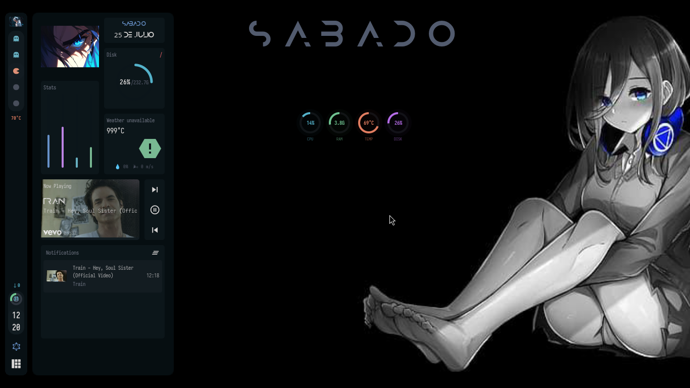
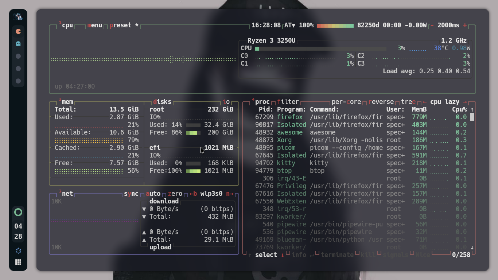

<div align="center">
  
</div>

<br>

<div align="center">

[](https://github.com/fc4419039/awesome-rxyhn-remix/stargazers)
[](https://github.com/fc4419039/awesome-rxyhn-remix/blob/main/LICENSE)
[](https://github.com/fc4419039/awesome-rxyhn-remix#installation--instalación)
[](https://awesomewm.org/)
[](https://archlinux.org/)
[](https://www.lua.org/)

</div>

<br>

<div align="center">
  
</div>

<br>

<h1 align="center">
  AwesomeWM Dotfiles — Modernized & Fixed Remix
</h1>

<p align="center">
  <i>rxyhn's legendary dotfiles — lost to the void, now reborn with modern AwesomeWM APIs, bug fixes, and a bag of extras.</i>
</p>

<br>

<div align="center">
  <h3>Stack</h3>
  <p>
    
    
    
    
    
    
    
    
    
    
  </p>
</div>

<br>

<div align="center">
  <a href="#english"></a>
  <a href="#español"></a>
</div>

<br>

---

<br>

<h2 align="center">
  
</h2>

<br>

<div align="center">
  <table>
    <tr>
      <td width="50%" align="center">
        
        <br>
        <sub><b>Dashboard</b></sub>
      </td>
      <td width="50%" align="center">
        
        <br>
        <sub><b>Lock Screen</b></sub>
      </td>
    </tr>
    <tr>
      <td width="50%" align="center">
        
        <br>
        <sub><b>Widgets & Menus</b></sub>
      </td>
      <td width="50%" align="center">
        
        <br>
        <sub><b>System Monitor</b></sub>
      </td>
    </tr>
  </table>
</div>

<br>

---

<br>

<!-- ==================== ENGLISH ==================== -->

<h1 align="center" id="english">🇬🇧 English</h1>

<p align="center">
  A complete <b>AwesomeWM</b> configuration: repaired, optimized, and extended with modern features.
  Based on <b>rxyhn</b>'s original work (repo deleted) and the <b>Alpharivs</b> fork.
</p>

<br>

### Features

- **Wibar** — vertical bar on the left: Pac-Man taglist, battery arc, stacked clock, window list tooltips, layoutbox, notification-center button. Auto-hides on fullscreen (`Ctrl+F` to toggle).
- **Dashboard** — slide-in from the left: profile, music with cover art & progress, media controls, clock, todo arc, **weather** (Open-Meteo, no API key — location auto-detected by IP), system stats, recent notifications.
- **Notification Center** — scrollable history, clear-all, and a **Do Not Disturb that actually works**: popups are silenced *and queued* until you turn it back on.
- **Notification audio** — isolated PipeWire sink, screenshot sounds, auto-router, independent volume (`Super+v`), low-latency loopback, fully silenced by DND.
- **Rofi menus** — launcher, wifi, bluetooth, power, GTK3 volume sliders, and instant **accent cycling** across 12 colors.
- **Window decorations** — round buttons, WiFi/IP/VPN info, 2px accent border. **Borders & titlebars on by default** (`Ctrl+Super+Shift+B` / `+T` to toggle). ncmpcpp windows get a full music titlebar with album art, seek bar & controls.
- **Lock screen** — PAM auth, English word clock, music controls, rainbow keys (`Mod+Ctrl+L`).
- **Alt+Tab switcher** — live window thumbnails with keyboard navigation.
- **System Menu** — slide-out panel: blur, transparency, night mode, wallpaper, music, accent, borders/titlebars, widgets, power.
- **Layouts** — tile, floating, centered, mstab, horizontal, machi, equalarea, deck.
- **MSCDown** — bundled YouTube music searcher/downloader (`musica` or `musica <query>`), auto-installed with the dotfiles. The installer **skips it if already present**.
- **Multi-monitor** — independent wibars, dashboards and tags per screen (`Mod+Ctrl+j/k`).
- **Touchegg gestures** — 3-finger swipe for the desktop overview, 4-finger to change desktops, pinches to close windows or open the launcher.

### Keyboard Shortcuts

| Key | Action |
|---|---|
| `Mod+Enter` | Terminal (kitty) |
| `Mod+d` | Rofi launcher |
| `Mod+Shift+d` | Dashboard |
| `Mod+w` / `Mod+Shift+w` | Web browser / WiFi menu |
| `Mod+b` / `Mod+v` | Bluetooth / Volume |
| `Alt+F4` | Power menu |
| `Mod+p` | **No-sleep toggle** (keep screen on) |
| `Ctrl+Super+t` | **Toggle night mode** (redshift 3500K) |
| `Insert` / `Alt+Insert` | Screenshot / area screenshot |
| `Mod+z` | Scratchpad |
| `Mod+Ctrl+l` | Lock screen |
| `Ctrl+Super+b` | Cycle accent color |
| `Ctrl+Super+Shift+B` / `+T` | Toggle borders / titlebars |
| `Alt+Tab` | Window switcher |
| `Mod+e` | Desktop Overview |
| `Mod+Shift+v` | Clipboard history |
| `Mod+s` / `Mod+Shift+s` / `Mod+Space` | Tile / floating / next layout |
| `Mod+q` | Close window |
| `Mod+f` | File manager |
| `Ctrl+F` | Toggle wibar |
| `Mod+[1-5]` / `Mod+Shift+[1-5]` | Switch / move to tag |
| `Mod+Arrow` / `Mod+Shift+Arrow` | Directional focus / swap |
| `Mod+=/-` | Adjust useless gap |
| `Mod+x` | Color picker |
| `Mod+i` / `Mod+o` | Spotify / Opera GX |
| `Mod+Shift+n` | Music client (ncmpcpp) |
| `Mod+Ctrl+d` | Show desktop (minimize all) |
| `Mod+Shift+f` | Toggle fullscreen |
| `Mod+F1` | Keybinding help |
| `Mod+Ctrl+r` | Reload AwesomeWM |
| `XF86Audio*` / `XF86MonBrightness*` | Volume, brightness & playback keys |

### Extras

Sloppy & flash focus · window swallowing · scratchpad · save floats · better resize · rounded corners · OSD volume/brightness notifications · clipboard history (cliphist) · macOS-style floating calculator · desktop context menu with wallpaper picker · **blur/transparency toggles with persistent state** (survives reboot via `~/.cache/awesome`) · `reset-theme.sh` emergency reset · three picom configs (solid/blur/transparency) · **UI watchdog** that auto-repairs broken panels · OpenCode AI config included.

### Developer Tools

`config/awesome/scripts/check.sh` validates the syntax of every Lua, Shell and Python file in the config — your dotfiles' CI. Run it **before restarting awesome or committing** to catch errors that would crash the WM into fallback mode.

```bash
config/awesome/scripts/check.sh                       # from the repo (before install)
~/.config/awesome/scripts/check.sh                    # from your installed config
~/.config/awesome/scripts/check.sh <another/dir>      # check any directory (e.g. the repo)
~/.config/awesome/scripts/check.sh --watch            # continuous watch mode (every 2s)
```

Exit code `0` = all OK, `1` = syntax errors found (file:line shown).

<br>

---

<br>

<!-- ==================== ESPAÑOL ==================== -->

<h1 align="center" id="español">🇪🇸 Español</h1>

<p align="center">
  Configuración completa de <b>AwesomeWM</b>, reparada, optimizada y extendida con funcionalidades modernas.
  Basada en el trabajo original de <b>rxyhn</b> (repo eliminado) y el <b>Alpharivs</b> fork.
</p>

<br>

### Características

- **Wibar** — barra vertical a la izquierda: taglist Pac-Man, arco de batería, reloj apilado, tooltips de ventanas, layoutbox, botón del centro de notificaciones. Se oculta en pantalla completa (`Ctrl+F` para alternar).
- **Dashboard** — panel deslizable desde la izquierda: perfil, música con carátula y progreso, controles multimedia, reloj, arco de tareas, **clima** (Open-Meteo, sin API key — ubicación detectada por IP), estadísticas del sistema y notificaciones recientes.
- **Centro de notificaciones** — historial scrolleable, limpiar todo y un **no molestar que funciona de verdad**: silencia *y encola* los popups hasta que lo vuelvas a activar.
- **Audio de notificaciones** — sink aislado en PipeWire, sonidos de captura, router automático, volumen independiente (`Super+v`), loopback de baja latencia, silenciado por completo con no molestar.
- **Menús Rofi** — lanzador, wifi, bluetooth, power, sliders GTK3 de volumen y **cambio de acento** instantáneo entre 12 colores.
- **Decoraciones de ventana** — botones redondos, widgets WiFi/IP/VPN, borde de 2px del color de acento. **Bordes y titlebars activados por defecto** (`Ctrl+Super+Shift+B` / `+T` para alternar). Las ventanas de ncmpcpp tienen una titlebar de música completa con carátula, barra de búsqueda y controles.
- **Lock screen** — autenticación PAM, word clock en inglés, controles de música, teclas arcoíris (`Mod+Ctrl+L`).
- **Switcher Alt+Tab** — miniaturas en vivo con navegación por teclado.
- **System Menu** — panel deslizable: blur, transparencia, modo noche, fondo, música, acento, bordes/titlebars, widgets, power.
- **Layouts** — tile, floating, centered, mstab, horizontal, machi, equalarea, deck.
- **MSCDown** — buscador/descargador de música de YouTube incluido (`musica` o `musica <consulta>`), se instala automáticamente con el dotfiles. El instalador **lo salta si ya está presente**.
- **Multi-monitor** — wibar, dashboard y tags independientes por pantalla (`Mod+Ctrl+j/k`).
- **Gestos de Touchegg** — swipe de 3 dedos para el overview, 4 dedos para cambiar de escritorio, pinches para cerrar ventanas o abrir el lanzador.

### Atajos de teclado

| Tecla | Acción |
|---|---|
| `Mod+Enter` | Terminal (kitty) |
| `Mod+d` | Rofi lanzador |
| `Mod+Shift+d` | Dashboard |
| `Mod+w` / `Mod+Shift+w` | Navegador / menú WiFi |
| `Mod+b` / `Mod+v` | Bluetooth / Volumen |
| `Alt+F4` | Menú de apagado |
| `Mod+p` | **No-sleep** (mantener pantalla encendida) |
| `Ctrl+Super+t` | **Modo noche** (redshift 3500K) |
| `Insert` / `Alt+Insert` | Captura / captura de área |
| `Mod+z` | Scratchpad |
| `Mod+Ctrl+l` | Lock screen |
| `Ctrl+Super+b` | Ciclar color de acento |
| `Ctrl+Super+Shift+B` / `+T` | Quitar/poner bordes / titlebars |
| `Alt+Tab` | Window switcher |
| `Mod+e` | Desktop Overview |
| `Mod+Shift+v` | Historial del portapapeles |
| `Mod+s` / `Mod+Shift+s` / `Mod+Space` | Tile / floating / siguiente layout |
| `Mod+q` | Cerrar ventana |
| `Mod+f` | Explorador de archivos |
| `Ctrl+F` | Ocultar/mostrar wibar |
| `Mod+[1-5]` / `Mod+Shift+[1-5]` | Cambiar / mover a tag |
| `Mod+Arrow` / `Mod+Shift+Arrow` | Foco / intercambio direccional |
| `Mod+=/-` | Ajustar useless gap |
| `Mod+x` | Selector de color |
| `Mod+i` / `Mod+o` | Spotify / Opera GX |
| `Mod+Shift+n` | Cliente de música (ncmpcpp) |
| `Mod+Ctrl+d` | Mostrar escritorio (minimizar todo) |
| `Mod+Shift+f` | Pantalla completa |
| `Mod+F1` | Ayuda de atajos |
| `Mod+Ctrl+r` | Recargar AwesomeWM |
| `XF86Audio*` / `XF86MonBrightness*` | Volumen, brillo y reproducción |

### Extras

Foco sloppy y flash · window swallowing · scratchpad · save floats · mejor redimensionado · esquinas redondeadas · OSD de volumen/brillo · historial del portapapeles (cliphist) · calculadora flotante estilo macOS · menú contextual con selector de fondo · **toggles de blur/transparencia con estado persistente** (sobrevive al reinicio vía `~/.cache/awesome`) · reset de emergencia `reset-theme.sh` · tres configs de picom (sólido/blur/transparencia) · **UI watchdog** que repara paneles rotos · configuración del agente OpenCode incluida.

### Herramientas de desarrollo

`config/awesome/scripts/check.sh` valida la sintaxis de todos los archivos Lua, Shell y Python de la config — el "CI" de tus dotfiles. Ejecútalo **antes de reiniciar awesome o de hacer commit** para detectar errores que romperían el WM y lo mandarían a modo fallback.

```bash
config/awesome/scripts/check.sh                       # desde el repo (antes de instalar)
~/.config/awesome/scripts/check.sh                    # desde tu config instalada
~/.config/awesome/scripts/check.sh <otro/dir>         # revisa cualquier directorio (ej. el repo)
~/.config/awesome/scripts/check.sh --watch            # modo vigilancia continua (cada 2s)
```

Código de salida `0` = todo OK, `1` = errores de sintaxis (muestra archivo:línea).

<br>

---

<br>

<!-- ==================== SHARED SECTIONS ==================== -->

<h2 align="center">Installation / Instalación</h2>

<br>

<details>
<summary><strong>📦 Automatic / Automática</strong></summary>

<br>

```bash
git clone --recurse-submodules https://github.com/fc4419039/awesome-rxyhn-remix.git
cd awesome-rxyhn-remix
chmod +x install.sh
./install.sh
```

> The installer is **smart**: it detects already-installed packages and skips them, won't reconfigure what's already configured, and won't re-clone or re-install mscdown if it's already present.
>
> El instalador es **inteligente**: detecta los paquetes ya instalados y los omite, no reconfigura lo ya configurado y no vuelve a clonar ni instalar mscdown si ya está presente.

> ⚠️ `sudo` is only required for the SDDM theme installation.
> ⚠️ El script requiere `sudo` solo para instalar el tema SDDM.

</details>

<br>

<details>
<summary><strong>🔧 Manual</strong></summary>

<br>

**Dependencies / Dependencias** (Arch Linux):

```bash
yay -S awesome-git picom-git kitty rofi todo-bin acpi acpid \
wireless_tools jq inotify-tools polkit-gnome xdotool xclip maim \
brightnessctl alsa-utils alsa-tools pipewire pipewire-pulse wireplumber \
playerctl feh zsh neovim btop lsd bat python-gobject pipewire-alsa xcolor-pick \
touchegg cliphist xorg-xset mpc xorg-xprop xorg-xwininfo xdg-utils \
xdg-user-dirs libpulse psmisc --needed
```

**Fonts / Fuentes:** Iosevka Nerd Font, JetBrains Mono Nerd Font, Hack Nerd Font, Material Design Icons, Weather Icons + icomoon fonts in `fonts/`

**Copy config / Copiar configuración:**

```bash
cp -r config/* ~/.config/
cp -r bin/* ~/.local/bin/
```

**No API keys needed / Sin API keys:** the weather widget uses **Open-Meteo** and auto-detects your location by IP.
**Sin API keys:** el widget de clima usa **Open-Meteo** y detecta tu ubicación por IP.

**Wallpapers:** place images in `~/fondos/`

**Logout & select AwesomeWM / Cerrar sesión e iniciar AwesomeWM**

</details>

<br>

---

<br>

<h2 align="center">Repository Structure / Estructura del Repositorio</h2>

<br>

```
awesome-rxyhn-remix/
├── bin/                      # Scripts personalizados (awesomefetch, screensht, xcolor-pick)
├── config/
│   ├── awesome/              # Configuración principal de AwesomeWM
│   │   ├── configuration/    # Autostart, keybindings, rules
│   │   ├── module/           # Módulos externos (bling, rubato, layout-machi)
│   │   ├── scripts/          # Scripts Lua/Shell (toggles, utilidades)
│   │   ├── signal/           # Señales (volumen, batería, playerctl)
│   │   ├── theme/            # Temas, picom configs, rofi Rasi
│   │   ├── ui/               # Widgets, wibar, dashboard, lockscreen
│   │   ├── rc.lua            # Entry point
│   │   └── secrets.lua.template
│   ├── kitty/                # Terminal
│   ├── mpd/                  # MPD config
│   ├── ncmpcpp/              # Cliente MPD
│   ├── nvim/                 # Neovim
│   ├── rofi/                 # Menús Rofi
│   ├── starship/             # Prompt
│   ├── systemd/user/         # Servicios de usuario (mpd, mpd-mpris, udiskie, limpieza)
│   └── touchegg/             # Gestos touchpad
├── fonts/                    # Fuentes Icomoon personalizadas
├── fondos/                   # Wallpapers
├── sddm/                     # Tema SDDM (sugar-candy)
├── mscdown/                  # Submódulo: buscador música YouTube
├── misc/                     # .Xresources, .profile, .zshrc
├── install.sh                # Instalador principal
├── update_modules.sh         # Actualiza módulos externos (bling, rubato, machi)
├── check.sh                  # Validador sintaxis (Lua/Shell/Python)
└── opencode.json             # Configuración agente OpenCode
```

<br>

---

<br>

<h2 align="center">Dependencies / Dependencias Completas</h2>

<br>

El instalador (`install.sh`) gestiona todo automáticamente. Lista completa para Arch/Manjaro:

```bash
yay -S --needed \
  awesome-git picom-git kitty rofi todo-bin acpi acpid \
  wireless_tools jq inotify-tools polkit-gnome xdotool xclip maim \
  brightnessctl alsa-utils alsa-tools pipewire pipewire-pulse wireplumber libpulse psmisc \
  qt5-imageformats qt6-imageformats \
  playerctl spotify mpd mpc ncmpcpp mpd-mpris blueman pasystray \
  touchegg redshift networkmanager bluez libnotify curl ffmpeg gpick \
  imagemagick thunar firefox xorg-xrdb yad xcolor-pick cliphist xdg-utils xdg-user-dirs \
  nerd-fonts-jetbrains-mono ttf-iosevka-nerd ttf-hack-nerd ttf-font-awesome \
  ttf-material-design-icons ttf-weather-icons \
  zsh-syntax-highlighting zsh-autosuggestions zsh-sudo zoxide feh zsh neovim \
  btop lsd bat python-dbus python-gobject python-pip python-pyqt5 pipewire-alsa \
  powerlevel10k fzf starship autorandr xorg-xrandr pamixer gtk3 \
  sound-theme-freedesktop xorg-xset xorg-xprop xorg-xwininfo \
  bc pacman-contrib xorg-setxkbmap upower lua git
```

> **¿Qué hace cada uno nuevo?**
> - `bc` — necesario para `cycle-accent.sh` (oscurecer colores al cambiar acento)
> - `pacman-contrib` — `paccache` usado por `limpiar_sistema.sh`
> - `xorg-setxkbmap` — `change-keyboard.sh` y atajo de teclado
> - `upower` — `bluetooth.sh` muestra batería de dispositivos
> - `lua` — `luac` para `check.sh`
> - `git` — submodules y clonar powerlevel10k
> - `mpd-mpris` — puente MPRIS para controles multimedia (dashboard, notificaciones)
> - `udiskie` + `udisks2` — automontaje USB/externos (activado por defecto)

<br>

---

<br>

<h2 align="center">Servicios systemd habilitados por el instalador</h2>

<br>

| Servicio | Tipo | Descripción |
|---|---|---|
| `mpd.service` | user | Servidor de música (mpd) |
| `mpd-mpris.service` | user | Puente MPRIS → controles multimedia en dashboard/notificaciones |
| `udiskie.service` | user | Automontaje USB/discos externos con notificaciones |
| `limpiar-sistema.timer` | user | Limpieza automática cada 3 días (`limpiar_sistema.sh`) |
| `touchegg.service` | system (root) | Daemon de gestos touchpad |

> **Nota:** los servicios de usuario se habilitan con `systemctl --user enable --now`. El daemon `touchegg` corre como root; el cliente se lanza desde autostart.

<br>

---

<br>

<h2 align="center">Troubleshooting / Solución de problemas</h2>

<br>

<details>
<summary><strong>🔍 Validar la configuración antes de reiniciar</strong></summary>

<br>

```bash
# Desde el repo (antes de instalar)
config/awesome/scripts/check.sh

# Desde la config instalada
~/.config/awesome/scripts/check.sh

# Modo vigilancia continua
~/.config/awesome/scripts/check.sh --watch
```

> Exit code `0` = OK, `1` = errores de sintaxis (muestra archivo:línea). Ejecútalo **antes de recargar Awesome (`Super+Ctrl+R`) o de hacer commit** para no romper la sesión.

</details>

<br>

<details>
<summary><strong>🎵 La música no suena / MPD no inicia</strong></summary>

<br>

```bash
# Verificar servicios
systemctl --user status mpd.service mpd-mpris.service

# Habilitar si faltan
systemctl --user enable --now mpd.service mpd-mpris.service

# Verificar config
cat ~/.config/mpd/mpd.conf
# music_directory debe ser ~/Music (creado por install.sh)
```

</details>

<br>

<details>
<summary><strong>🎨 Cambiar acento no oscurece bien (bc faltante)</strong></summary>

<br>

```bash
sudo pacman -S bc
```
> `cycle-accent.sh` usa `bc -l` para calcular tonos oscuros del acento.

</details>

<br>

<details>
<summary><strong>⚙️ Awesome entra en modo fallback (pantalla negra/rota)</strong></summary>

<br>

1. `Mod+Ctrl+Shift+R` recarga la config (si responde).
2. Si no: entra en TTY (`Ctrl+Alt+F3`), ejecuta:
   ```bash
   ~/.config/awesome/scripts/check.sh
   ```
   Corrige los errores que muestre.
3. `awesome -k -c ~/.config/awesome/rc.lua` valida sintaxis completa.

</details>

<br>

<details>
<summary><strong>🔐 secrets.lua / clima no funciona</strong></summary>

<br>

```bash
# Si falta, se genera del template al instalar
cp ~/.config/awesome/secrets.lua.template ~/.config/awesome/secrets.lua
# Edita weather_location_override si quieres forzar ubicación
```

> El widget usa **Open-Meteo** (sin API key) + IP geolocation automática.

</details>

<br>

<details>
<summary><strong>📦 Paquetes AUR fallan al instalar</strong></summary>

<br>

```bash
# Verifica AUR helper
command -v yay || command -v paru

# Limpia cache y reintenta
yay -S --clean
# o
paru -S --clean
```

</details>

<br>

---

<br>

<div align="center">

**rxyhn** — Original design • **Alpharivs** — Fork base • **s4vitar** — Zsh config • **ner0z** — Colorscheme night • **ChocolateBread799**, **JavaCafe01** — Original contributions

<br>
<br>

| Source | Description |
|---|---|
| [rxyhn](https://github.com/rxyhn) (original, deleted) | Dotfiles original de AwesomeWM |
| [Alpharivs](https://github.com/Alpharivs/dotfiles) | Fork base usado para esta remix |
| [s4vitar](https://github.com/s4vitar) | Configuración de zsh |
| [ner0z](https://github.com/ner0z) | Colorscheme night |

</div>

<br>

---

<br>

<div align="center">
  <p>
    <i>⭐ If you found this useful, please leave a star — it helps me keep improving it. Thanks! 🫶</i>
    <br>
    <i>⭐ Si este dotfiles te fue útil, ¡deja una estrella! Me ayuda a seguir mejorándolo. 🫶</i>
  </p>
  <br>

  [](https://github.com/fc4419039/awesome-rxyhn-remix/stargazers)
  [](https://github.com/fc4419039/awesome-rxyhn-remix/blob/main/LICENSE)

  <br>
  <p align="center"><a href="https://github.com/fc4419039/awesome-rxyhn-remix/blob/main/LICENSE"></a></p>
</div>
