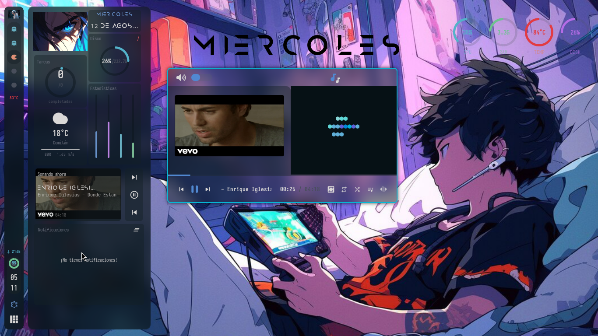

<div align="center">
  
</div>

<br>

<div align="center">

[](https://github.com/fc4419039/awesome-rxyhn-remix/stargazers)
[](https://github.com/fc4419039/awesome-rxyhn-remix/blob/main/LICENSE)
[](#installation--instalación)
[](https://awesomewm.org/)
[](https://www.kernel.org/)
[](https://archlinux.org/)
[](https://www.debian.org/)
[](https://getfedora.org/)
[](https://www.lua.org/)

</div>

<br>

<div align="center">
  
</div>

<br>

<h1 align="center">
  AwesomeWM Dotfiles — Modernized & Fixed Remix
</h1>

<p align="center">
  <i>rxyhn's legendary dotfiles — recovered, rebuilt on modern AwesomeWM APIs, bugs fixed, and extended with useful extras. <b>Works on any Linux distro</b>: Arch, Debian/Ubuntu, Fedora, openSUSE and NixOS — with both <b>AwesomeWM stable (4.3)</b> and <b>AwesomeWM-git</b>.</i>
</p>

<br>

<div align="center">
  <h3>Stack</h3>
  <p>
    
    
    
    
    
    
    
    
    
    
    
    
  </p>
</div>

<br>

<div align="center">
  <a href="#english"></a>
  <a href="#español"></a>
</div>

<br>

---

<br>

## 📑 Table of Contents / Índice

- [Features](#features) / [Características](#características)
- [Screenshots / Capturas](#screenshots--capturas)
- [Keyboard Shortcuts](#keyboard-shortcuts) / [Atajos de teclado](#atajos-de-teclado)
- [Installation / Instalación](#installation--instalación)
- [SDDM: keep the sugar-candy login after a theme update / Mantener el login sugar-candy](#sddm-keep-the-sugar-candy-login-after-a-theme-update--mantener-el-login-sugar-candy-tras-una-actualización)
- [Repository Structure / Estructura](#repository-structure--estructura-del-repositorio)
- [Dependencies / Dependencias](#dependencies--dependencias-completas)
- [Systemd Services / Servicios](#systemd-services--servicios-systemd)
- [Troubleshooting / Solución de problemas](#troubleshooting--solución-de-problemas)
- [Credits / Créditos](#credits--créditos)

---

<br>

<a id="screenshots--capturas"></a>

## 🖼️ Screenshots / Capturas

<div align="center">
  <table>
    <tr>
      <td width="50%" align="center">
        
        <br><sub><b>Dashboard</b></sub>
      </td>
      <td width="50%" align="center">
        
        <br><sub><b>Lock Screen</b></sub>
      </td>
    </tr>
    <tr>
      <td width="50%" align="center">
        
        <br><sub><b>Widgets & Menus</b></sub>
      </td>
      <td width="50%" align="center">
        
        <br><sub><b>System Monitor</b></sub>
      </td>
    </tr>
  </table>
</div>

---

<br>

<!-- ==================== ENGLISH ==================== -->

<h1 align="center" id="english">🇬🇧 English</h1>

<p align="center">
  A complete <b>AwesomeWM</b> configuration: repaired, optimized, and extended with modern features.
  Based on <b>rxyhn</b>'s original work (repo deleted) and the <b>Alpharivs</b> fork.
  <br><br>
  🚀 <b>Runs on any distro</b> — the installer auto-detects your package manager
  (<code>pacman</code> / <code>apt</code> / <code>dnf</code> / <code>zypper</code> / <code>nix</code>),
  and the config works on <b>AwesomeWM 4.3 (stable)</b> and <b>AwesomeWM-git</b>.
</p>

### Features

- **Wibar** — Vertical left bar: Pac-Man taglist, battery arc, stacked clock, window list tooltips, layoutbox, notification-center button. Auto-hides on fullscreen (`Ctrl+F` to toggle).
- **Dashboard** — Slide-in from left: profile, music with cover art & progress, media controls, clock, todo arc, **weather** (Open-Meteo, no API key — location auto-detected by IP), system stats, recent notifications.
- **Notification Center** — Scrollable history, clear-all, and a **Do Not Disturb that actually works**: popups are silenced *and queued* until re-enabled.
- **Notification audio** — Isolated PipeWire sink, screenshot sounds, auto-router, independent volume (`Super+v`), low-latency loopback, fully silenced by DND.
- **Rofi menus** — Launcher, WiFi, Bluetooth, power, GTK3 volume sliders, instant **accent cycling** across 12 colors.
- **Window decorations** — Round buttons, WiFi/IP/VPN info, 2px accent border. **Borders & titlebars on by default** (`Ctrl+Super+Shift+B` / `+T` to toggle). ncmpcpp windows get a full music titlebar with album art, seek bar & controls.
- **Lock screen** — PAM auth, English word clock, music controls, rainbow keys (`Mod+Ctrl+L`).
- **Alt+Tab switcher** — Live window thumbnails with keyboard navigation.
- **System Menu** — Slide-out panel: blur, transparency, night mode, wallpaper, music, accent, borders/titlebars, widgets, power.
- **Layouts** — Tile, floating, centered, mstab, horizontal, machi, equalarea, deck.
- **MSCDown** — Bundled YouTube music searcher/downloader (`musica` or `musica <query>`), auto-installed. The installer **skips it if already present**.
- **Multi-monitor** — Independent wibars, dashboards and tags per screen (`Mod+Ctrl+j/k`).
- **Touchegg gestures** — 3-finger swipe for desktop overview, 4-finger to change desktops, pinches to close windows or open launcher.

### Keyboard Shortcuts

| Key | Action |
|---|---|
| `Mod+Enter` | Terminal (kitty) |
| `Mod+d` | Rofi launcher |
| `Mod+Shift+d` | Dashboard |
| `Mod+w` / `Mod+Shift+w` | Web browser / WiFi menu |
| `Mod+b` / `Mod+v` | Bluetooth / Volume |
| `Alt+F4` | Power menu |
| `Mod+p` | **No-sleep toggle** (keep screen on) |
| `Ctrl+Super+t` | **Toggle night mode** (redshift 3500K) |
| `Insert` / `Alt+Insert` | Screenshot / area screenshot |
| `Mod+z` | Scratchpad |
| `Mod+Ctrl+l` | Lock screen |
| `Ctrl+Super+b` | Cycle accent color |
| `Ctrl+Super+Shift+B` / `+T` | Toggle borders / titlebars |
| `Alt+Tab` | Window switcher |
| `Mod+e` | Desktop Overview |
| `Mod+Shift+v` | Clipboard history |
| `Mod+s` / `Mod+Shift+s` / `Mod+Space` | Tile / floating / next layout |
| `Mod+q` | Close window |
| `Mod+f` | File manager |
| `Ctrl+F` | Toggle wibar |
| `Mod+[1-5]` / `Mod+Shift+[1-5]` | Switch / move to tag |
| `Mod+Arrow` / `Mod+Shift+Arrow` | Directional focus / swap |
| `Mod+=/-` | Adjust useless gap |
| `Mod+x` | Color picker |
| `Mod+i` / `Mod+o` | Spotify / Opera GX |
| `Mod+Shift+n` | Music client (ncmpcpp) |
| `Mod+Ctrl+d` | Show desktop (minimize all) |
| `Mod+Shift+f` | Toggle fullscreen |
| `Mod+F1` | Keybinding help |
| `Mod+Ctrl+r` | Reload AwesomeWM |
| `XF86Audio*` / `XF86MonBrightness*` | Volume, brightness & playback keys |

### Extras

Sloppy & flash focus · window swallowing · scratchpad · save floats · better resize · rounded corners · OSD volume/brightness notifications · clipboard history (cliphist) · macOS-style floating calculator · desktop context menu with wallpaper picker · **blur/transparency toggles with persistent state** (survives reboot via `~/.cache/awesome`) · `reset-theme.sh` emergency reset · three picom configs (solid/blur/transparency) · **UI watchdog** that auto-repairs broken panels · OpenCode AI config included.

### Developer Tools

`config/awesome/scripts/check.sh` validates **syntax + runtime** (module loading, broken requires, load errors) — your dotfiles' CI. Run it **before restarting awesome or committing** to catch errors that would crash the WM.

```bash
config/awesome/scripts/check.sh                       # from repo (before install)
~/.config/awesome/scripts/check.sh                    # from your installed config
config/awesome/scripts/check.sh <other/dir>           # check any directory
~/.config/awesome/scripts/check.sh --syntax           # syntax only (fast)
~/.config/awesome/scripts/check.sh --runtime          # runtime only
~/.config/awesome/scripts/check.sh --full             # full (default)
~/.config/awesome/scripts/check.sh --watch            # continuous watch mode
```

Exit code `0` = OK, `1` = errors (file:line shown). Works from **any directory**.

**Unit tests** (36 tests — helpers, shapes, strings, markup, client, wibox, system):
```bash
bash ~/.config/awesome/tests/run_tests.sh             # 36 tests pass
```

---

<br>

<!-- ==================== ESPAÑOL ==================== -->

<h1 align="center" id="español">🇪🇸 Español</h1>

<p align="center">
  Configuración completa de <b>AwesomeWM</b>, reparada, optimizada y extendida con funcionalidades modernas.
  Basada en el trabajo original de <b>rxyhn</b> (repo eliminado) y el fork de <b>Alpharivs</b>.
  <br><br>
  🚀 <b>Funciona en cualquier distro</b> — el instalador detecta tu gestor de paquetes
  (<code>pacman</code> / <code>apt</code> / <code>dnf</code> / <code>zypper</code> / <code>nix</code>),
  y la config es compatible con <b>AwesomeWM 4.3 (estable)</b> y <b>AwesomeWM-git</b>.
</p>

### Características

- **Wibar** — Barra vertical a la izquierda: taglist Pac-Man, arco de batería, reloj apilado, tooltips de ventanas, layoutbox, botón del centro de notificaciones. Se oculta en pantalla completa (`Ctrl+F` para alternar).
- **Dashboard** — Panel deslizable desde la izquierda: perfil, música con carátula y progreso, controles multimedia, reloj, arco de tareas, **clima** (Open-Meteo, sin API key — ubicación detectada por IP), estadísticas del sistema y notificaciones recientes.
- **Centro de notificaciones** — Historial scrolleable, limpiar todo y un **no molestar que funciona de verdad**: silencia *y encola* los popups hasta que lo vuelvas a activar.
- **Audio de notificaciones** — Sink aislado en PipeWire, sonidos de captura, router automático, volumen independiente (`Super+v`), loopback de baja latencia, silenciado por completo con no molestar.
- **Menús Rofi** — Lanzador, WiFi, Bluetooth, power, sliders GTK3 de volumen y **cambio de acento** instantáneo entre 12 colores.
- **Decoraciones de ventana** — Botones redondos, widgets WiFi/IP/VPN, borde de 2px del color de acento. **Bordes y titlebars activados por defecto** (`Ctrl+Super+Shift+B` / `+T` para alternar). Las ventanas de ncmpcpp tienen una titlebar de música completa con carátula, barra de búsqueda y controles.
- **Lock screen** — Autenticación PAM, word clock en inglés, controles de música, teclas arcoíris (`Mod+Ctrl+L`).
- **Switcher Alt+Tab** — Miniaturas en vivo con navegación por teclado.
- **System Menu** — Panel deslizable: blur, transparencia, modo noche, fondo, música, acento, bordes/titlebars, widgets, power.
- **Layouts** — Tile, floating, centered, mstab, horizontal, machi, equalarea, deck.
- **MSCDown** — Buscador/descargador de música de YouTube incluido (`musica` o `musica <consulta>`), se instala automáticamente. El instalador **lo salta si ya está presente**.
- **Multi-monitor** — Wibar, dashboard y tags independientes por pantalla (`Mod+Ctrl+j/k`).
- **Gestos de Touchegg** — Swipe de 3 dedos para el overview, 4 dedos para cambiar de escritorio, pinches para cerrar ventanas o abrir el lanzador.

### Atajos de teclado

| Tecla | Acción |
|---|---|
| `Mod+Enter` | Terminal (kitty) |
| `Mod+d` | Rofi lanzador |
| `Mod+Shift+d` | Dashboard |
| `Mod+w` / `Mod+Shift+w` | Navegador / menú WiFi |
| `Mod+b` / `Mod+v` | Bluetooth / Volumen |
| `Alt+F4` | Menú de apagado |
| `Mod+p` | **No-sleep** (mantener pantalla encendida) |
| `Ctrl+Super+t` | **Modo noche** (redshift 3500K) |
| `Insert` / `Alt+Insert` | Captura / captura de área |
| `Mod+z` | Scratchpad |
| `Mod+Ctrl+l` | Lock screen |
| `Ctrl+Super+b` | Ciclar color de acento |
| `Ctrl+Super+Shift+B` / `+T` | Quitar/poner bordes / titlebars |
| `Alt+Tab` | Window switcher |
| `Mod+e` | Desktop Overview |
| `Mod+Shift+v` | Historial del portapapeles |
| `Mod+s` / `Mod+Shift+s` / `Mod+Space` | Tile / floating / siguiente layout |
| `Mod+q` | Cerrar ventana |
| `Mod+f` | Explorador de archivos |
| `Ctrl+F` | Ocultar/mostrar wibar |
| `Mod+[1-5]` / `Mod+Shift+[1-5]` | Cambiar / mover a tag |
| `Mod+Arrow` / `Mod+Shift+Arrow` | Foco / intercambio direccional |
| `Mod+=/-` | Ajustar useless gap |
| `Mod+x` | Selector de color |
| `Mod+i` / `Mod+o` | Spotify / Opera GX |
| `Mod+Shift+n` | Cliente de música (ncmpcpp) |
| `Mod+Ctrl+d` | Mostrar escritorio (minimizar todo) |
| `Mod+Shift+f` | Pantalla completa |
| `Mod+F1` | Ayuda de atajos |
| `Mod+Ctrl+r` | Recargar AwesomeWM |
| `XF86Audio*` / `XF86MonBrightness*` | Volumen, brillo y reproducción |

### Extras

Foco sloppy y flash · window swallowing · scratchpad · save floats · mejor redimensionado · esquinas redondeadas · OSD de volumen/brillo · historial del portapapeles (cliphist) · calculadora flotante estilo macOS · menú contextual con selector de fondo · **toggles de blur/transparencia con estado persistente** (sobrevive al reinicio vía `~/.cache/awesome`) · reset de emergencia `reset-theme.sh` · tres configs de picom (sólido/blur/transparencia) · **UI watchdog** que repara paneles rotos · configuración del agente OpenCode incluida.

### Herramientas de desarrollo

`config/awesome/scripts/check.sh` valida sintaxis **y runtime** (carga de módulos, requires rotos, errores de carga) — el "CI" de tus dotfiles. Ejecútalo **antes de reiniciar awesome o de hacer commit** para detectar errores que romperían el WM.

```bash
config/awesome/scripts/check.sh                       # desde el repo (antes de instalar)
~/.config/awesome/scripts/check.sh                    # desde tu config instalada
config/awesome/scripts/check.sh <otro/dir>            # revisa cualquier directorio
~/.config/awesome/scripts/check.sh --syntax           # solo sintaxis (rápido)
~/.config/awesome/scripts/check.sh --runtime          # solo runtime
~/.config/awesome/scripts/check.sh --full             # completo (default)
~/.config/awesome/scripts/check.sh --watch            # modo vigilancia continua
```

Código de salida `0` = OK, `1` = errores (archivo:línea). Funciona desde **cualquier directorio**.

**Tests unitarios** (36 tests — helpers, shapes, strings, markup, client, wibox, system):
```bash
bash ~/.config/awesome/tests/run_tests.sh             # 36 tests pasan
```

---

<br>

<a id="installation--instalación"></a>

## ⚡ Installation / Instalación

```bash
git clone --recurse-submodules https://github.com/fc4419039/awesome-rxyhn-remix.git
cd awesome-rxyhn-remix
chmod +x install.sh
./install.sh
```

> The installer is **smart**: detects already-installed packages and skips them, won't reconfigure what's already configured, and won't re-clone or re-install mscdown if it's already present.
>
> El instalador es **inteligente**: detecta paquetes ya instalados y los omite, no reconfigura lo ya configurado y no vuelve a clonar ni instalar mscdown si ya está presente.
>
> 🖥️ **Works on any distro** — it auto-detects your OS and uses the right package manager (`pacman` / `apt` / `dnf` / `zypper` / NixOS). Compatible with both **AwesomeWM stable (4.3)** and **AwesomeWM-git**. Verified on Arch, Debian/Ubuntu, Fedora, openSUSE and NixOS.
>
> 🖥️ **Funciona en cualquier distro** — detecta tu sistema y usa el gestor correcto (`pacman` / `apt` / `dnf` / `zypper` / NixOS). Compatible con **AwesomeWM estable (4.3)** y **AwesomeWM-git**. Probado en Arch, Debian/Ubuntu, Fedora, openSUSE y NixOS.
>
> ⚠️ `sudo` is only required for the SDDM theme installation.
> ⚠️ El script requiere `sudo` solo para instalar el tema SDDM.

<br>

---

<br>

<a id="sddm-keep-the-sugar-candy-login-after-a-theme-update--mantener-el-login-sugar-candy-tras-una-actualización"></a>

## 🎨 SDDM: keep the sugar-candy login after a theme update / Mantener el login sugar-candy tras una actualización

The login screen uses the **bundled** `sddm-astronaut-theme` (Qt6) customized to look like **sugar-candy**. If you update the `sddm-astronaut-theme` AUR package, the update **overwrites** the theme with the stock look and you lose the sugar-candy style. To re-apply it, use the dedicated script:

La pantalla de inicio usa el tema **incluido** `sddm-astronaut-theme` (Qt6) personalizado para verse como **sugar-candy**. Si actualizas el paquete `sddm-astronaut-theme` (AUR), la actualización **sobrescribe** el tema con el aspecto por defecto y pierdes el estilo sugar-candy. Para re-aplicarlo, usa el script dedicado:

```bash
# From the repo root / Desde la raíz del repo
./setup-sddm-theme.sh
```

It will ask for your `sudo` password and then / Te pedirá tu contraseña `sudo` y luego:

1. **Copies the bundled theme** to `/usr/share/sddm/themes/` with the sugar-candy style (transparent login fields, white borders, orange accent, left-aligned form, `Welcome!` header).
   **Copia el tema incluido** a `/usr/share/sddm/themes/` con el estilo sugar-candy (campos transparentes, bordes blancos, acento naranja, formulario a la izquierda, cabecera `Welcome!`).
2. **Fixes the background folder permissions** (`/usr/share/sddm/backgrounds` owned by your user) so `system_menu` → **SDDM** can change the wallpaper without root.
   **Arregla los permisos de la carpeta de fondos** (`/usr/share/sddm/backgrounds` a tu usuario) para que `system_menu` → **SDDM** pueda cambiar el fondo sin root.
3. **Copies an initial background** from `~/fondos/` if there isn't one yet.
   **Copia un fondo inicial** desde `~/fondos/` si aún no hay ninguno.
4. **Activates the theme** writing `Current=sddm-astronaut-theme` in `/etc/sddm.conf.d/theme.conf`.
   **Activa el tema** escribiendo `Current=sddm-astronaut-theme` en `/etc/sddm.conf.d/theme.conf`.
5. **Enables the SDDM service** if it isn't already.
   **Habilita el servicio SDDM** si aún no está.

> It's safe to run it as many times as you want (idempotent). Log out afterwards to see the result.
> Es seguro ejecutarlo cuantas veces quieras (idempotente). Cierra sesión después para ver el resultado.

<br>

<a id="repository-structure--estructura-del-repositorio"></a>

## 📁 Repository Structure / Estructura del Repositorio

```
awesome-rxyhn-remix/
├── bin/                      # Custom scripts (awesomefetch, screensht, xcolor-pick)
├── config/
│   ├── awesome/              # Main AwesomeWM configuration
│   │   ├── configuration/    # Autostart, keybindings, rules
│   │   ├── module/           # External modules (bling, rubato, layout-machi)
│   │   ├── scripts/          # Scripts (toggles, check.sh validator, utilities)
│   │   ├── signal/           # Signals (volume, battery, playerctl, weather)
│   │   ├── theme/            # Themes, picom configs, rofi Rasi
│   │   ├── ui/               # Widgets, wibar, dashboard, lockscreen
│   │   ├── rc.lua            # Entry point
│   │   └── secrets.lua.template
│   ├── kitty/                # Terminal
│   ├── mpd/                  # MPD config
│   ├── ncmpcpp/              # MPD client
│   ├── nvim/                 # Neovim
│   ├── rofi/                 # Rofi menus
│   ├── starship/             # Prompt
│   ├── systemd/user/         # User services (mpd, mpd-mpris, udiskie, cleanup)
│   └── touchegg/             # Touchpad gestures
├── fonts/                    # Custom Icomoon fonts
├── fondos/                   # Wallpapers
├── sddm/sddm-astronaut-theme/  # SDDM theme (bundled, sugar-candy style, Qt6)
├── mscdown/                  # Submodule: YouTube music searcher
├── misc/                     # .Xresources, .profile, .zshrc, .p10k.zsh, grub-mkconfig.hook
├── install.sh                # Main installer
├── setup-grub-hook.sh        # Installs pacman hook that auto-regen grub.cfg
├── setup-sddm-theme.sh       # Re-applies only the SDDM theme (no full install)
├── update_modules.sh         # Updates external modules (bling, rubato, machi)
├── zsh-root.sh               # Symlinks /root zsh config → user's config
└── opencode.json             # OpenCode agent config
```

---

<br>

<a id="dependencies--dependencias-completas"></a>

## 📦 Dependencies / Dependencias Completas

The installer (`install.sh`) detects your distribution and installs **everything** automatically. Per-distro package lists are in `docs/`:

| Distro | Package manager | List |
|---|---|---|
| Arch / Manjaro | `pacman` (+ AUR helper) | [`docs/deps-arch.txt`](docs/deps-arch.txt) |
| Debian / Ubuntu / Mint | `apt` | [`docs/deps-debian.txt`](docs/deps-debian.txt) |
| Fedora | `dnf` | [`docs/deps-fedora.txt`](docs/deps-fedora.txt) |
| openSUSE | `zypper` | [`docs/deps-opensuse.txt`](docs/deps-opensuse.txt) |
| NixOS | `nix` | [`docs/deps-nixos.txt`](docs/deps-nixos.txt) |

> If your distro isn't listed, `install.sh` still configures everything and only skips the package installation step — install the equivalents yourself following the Arch list (the names map almost 1:1 across distros).

> Si tu distro no está en la lista, `install.sh` igual configura todo y solo omite el paso de instalación de paquetes — instala los equivalentes siguiendo la lista de Arch (los nombres casi siempre se mapean 1:1 entre distros).

**Arch/Manjaro reference** (the most complete list; used by `install.sh`):

```bash
yay -S --needed \
  awesome-git picom-git kitty rofi todo-bin acpi acpid \
  wireless_tools jq inotify-tools polkit-gnome xdotool xclip maim cliphist \
  brightnessctl alsa-utils alsa-tools pipewire pipewire-pulse wireplumber libpulse \
  qt5-imageformats qt6-imageformats \
  playerctl spotify onlyoffice-bin mpd mpc ncmpcpp mpd-mpris blueman pasystray \
  touchegg redshift networkmanager bluez bluez-utils libnotify curl ffmpeg gpick \
  imagemagick thunar firefox xorg-server xorg-xrdb xorg-xauth \
  xorg-xrandr xorg-setxkbmap xorg-xset xorg-xprop xdg-utils xdg-user-dirs \
  ttf-jetbrains-mono-nerd ttf-iosevka-nerd ttf-hack-nerd ttf-font-awesome \
  ttf-material-design-icons ttf-weather-icons \
  zsh-syntax-highlighting zsh-autosuggestions zsh-sudo zoxide fzf feh zsh neovim \
  btop lsd bat python-gobject python-dbus pipewire-alsa lua luarocks \
  zsh-theme-powerlevel10k sound-theme-freedesktop \
  i3lock slock xsecurelock sddm qt6-declarative \
  bc pacman-contrib upower autorandr udiskie udisks2 \
  git rsync
```

> **What are the new ones for?**
> - `cliphist` — clipboard history (`Super+Shift+V`)
> - `mpc` — media keys fallback + cover art in widgets
> - `bc` — needed by `cycle-accent.sh` (darken colors when cycling accent)
> - `pacman-contrib` — `paccache` used by `limpiar_sistema.sh`
> - `xorg-xprop` — `awesomefetch` reads the WM name
> - `xdg-user-dirs` / `xdg-utils` — `screensht` save dir + `xdg-open`
> - `autorandr` — auto-detect external monitors on start/hotplug (`rc.lua`)
> - `udiskie` + `udisks2` — auto-mount USB/external drives (user service enabled)
> - `upower` — `bluetooth.sh` shows device battery
> - `zsh-sudo` / `fzf` — `.zshrc` aliases and package search
> - `ttf-hack-nerd` — kitty's `HackNerdFont`
> - `python-dbus` — `bt_agent.py` (Bluetooth pairing agent)
> - `lua` — `luac` for `check.sh`
> - `git` — submodules and cloning powerlevel10k
> - `mpd-mpris` — MPRIS bridge for media controls (dashboard, notifications)

---

<br>

<a id="systemd-services--servicios-systemd"></a>

## 🔧 Systemd Services / Servicios systemd

| Service | Type | Description |
|---|---|---|
| `mpd.service` | user | Music server (mpd) |
| `mpd-mpris.service` | user | MPRIS bridge → media controls in dashboard/notifications |
| `udiskie.service` | user | Auto-mount USB/external drives with notifications |
| `limpiar-sistema.timer` | user | Auto cleanup every 3 days (`limpiar_sistema.sh`) |
| `touchegg.service` | system (root) | Touchpad gestures daemon |

> **Note:** user services enabled with `systemctl --user enable --now`. The `touchegg` daemon runs as root; the client launches from autostart.

---

<br>

<a id="troubleshooting--solución-de-problemas"></a>

## 🩹 Troubleshooting / Solución de problemas

<details>
<summary><strong>🔍 Validate config before restarting</strong></summary>

<br>

```bash
# From repo (before install)
config/awesome/scripts/check.sh

# From installed config
~/.config/awesome/scripts/check.sh

# Continuous watch mode
~/.config/awesome/scripts/check.sh --watch
```

> Exit code `0` = OK, `1` = syntax errors (shows file:line). Run **before reloading Awesome (`Super+Ctrl+R`) or committing** to avoid breaking your session.

</details>

<details>
<summary><strong>🎨 SDDM / Changing the login screen background</strong></summary>

<br>

The login theme is **sddm-astronaut-theme** (Qt6 compatible). It uses a fixed background image:

```
/usr/share/sddm/backgrounds/sddm_wallpaper.jpg
```

To change it whenever you want:

1. Open `system_menu` → **SDDM** (or run `set-sddm-bg.sh`).
2. Pick an image from `~/fondos/`.
3. Log out to see the new background (it doesn't apply in real time).

> The installer assigns `/usr/share/sddm/backgrounds` to your user. If you ever lack permissions, the script falls back to `pkexec` (it will ask for your password graphically).

> If a `sddm-astronaut-theme` AUR update overwrites the customization, re-apply the sugar-candy look with `./setup-sddm-theme.sh` — see the visible section **🎨 SDDM: keep the sugar-candy login after a theme update** above / mira la sección visible **🎨 SDDM: mantener el login sugar-candy tras una actualización** más arriba.

If you see the default SDDM theme on login instead of the astronaut one:

```bash
# Check the active theme
cat /etc/sddm.conf.d/theme.conf
# It should say: Current=sddm-astronaut-theme

# Re-enable it if missing
echo -e "[Theme]\nCurrent=sddm-astronaut-theme" | sudo tee /etc/sddm.conf.d/theme.conf

# If the theme folder is missing, re-apply it with the bundled script:
sudo cp -r sddm/sddm-astronaut-theme /usr/share/sddm/themes/
# (or simply: ./setup-sddm-theme.sh)
```

> The original **sugar-candy** theme is no longer used: its Qt5 build fails with SDDM 0.21+/Qt6. It was replaced by **sddm-astronaut-theme**, bundled in this repo and customized with the same visual style (transparent login fields with white borders, orange accent `#fb884f`, left-aligned form, `Welcome!` header).

</details>

<details>
<summary><strong>🖥️ Virtual Machine (QEMU/KVM, VirtualBox, VMware) — 3D Acceleration & Picom</strong></summary>

<br>

**Auto-detection:** The autostart script detects if you're running in a VM and automatically switches picom to `xrender` backend (no GPU required).

**If you have 3D acceleration enabled:**
- Picom uses `glx` backend (default) — full blur, transparency, shadows
- QEMU: requires `virtio-gpu` with `gl=on` in XML
- VirtualBox: requires Guest Additions with 3D enabled
- VMware: requires `open-vm-tools` with 3D

**If you DON'T have 3D acceleration (most VMs):**
- Picom auto-switches to `xrender` backend
- Blur effects are disabled (software rendering can't handle them)
- Shadows and transparency still work
- Dashboard and widgets function normally

**Manual override (if auto-detection fails):**
```bash
# Force xrender in VM without 3D
pkill picom
picom -b --backend xrender --config ~/.config/awesome/theme/picom.conf

# Force glx on host with GPU
pkill picom
picom -b --backend glx --config ~/.config/awesome/theme/picom.conf
```

**Enable 3D on existing QEMU VM (without losing data):**
```bash
# Stop VM
virsh destroy <VM_NAME>

# Edit XML
virsh edit <VM_NAME>

# Change video model to virtio-gpu with GL:
# <video>
#   <model type='virtio' heads='1' primary='yes'/>
# </video>
# <graphics type='spice' gl='on'>

# Start VM
virsh start <VM_NAME>
```

> **Note:** `virtio-gpu` with 3D requires QEMU compiled with `--enable-virtio-gpu`. Check with: `qemu-system-x86_64 -device 'help' | grep virtio-gpu`

</details>

<details>
<summary><strong>🎵 No sound / MPD won't start</strong></summary>

<br>

```bash
# Check services
systemctl --user status mpd.service mpd-mpris.service

# Enable if missing
systemctl --user enable --now mpd.service mpd-mpris.service

# Verify config
cat ~/.config/mpd/mpd.conf
# music_directory must be ~/Music (created by install.sh)
```

</details>

<details>
<summary><strong>🎨 Accent cycling doesn't darken properly (missing bc)</strong></summary>

<br>

```bash
sudo pacman -S bc
```
> `cycle-accent.sh` uses `bc -l` to calculate dark accent tones.

</details>

<details>
<summary><strong>⚙️ Awesome enters fallback mode (black/broken screen)</strong></summary>

<br>

1. `Mod+Ctrl+Shift+R` reloads config (if responsive).
2. If not: switch to TTY (`Ctrl+Alt+F3`), run:
   ```bash
   ~/.config/awesome/scripts/check.sh
   ```
   Fix any errors shown.
3. `awesome -k -c ~/.config/awesome/rc.lua` validates full syntax.

</details>

<details>
<summary><strong>🔐 secrets.lua / weather not working</strong></summary>

<br>

```bash
# If missing, generated from template on install
cp ~/.config/awesome/secrets.lua.template ~/.config/awesome/secrets.lua
# Edit weather_location_override to force location
```

> Widget uses **Open-Meteo** (no API key) + automatic IP geolocation.

</details>

<details>
<summary><strong>📦 AUR packages fail to install</strong></summary>

<br>

```bash
# Verify AUR helper
command -v yay || command -v paru

# Clean cache and retry
yay -S --clean
# or
paru -S --clean
```

</details>

<details>
<summary><strong>🖥️ Boot failure: `/boot/efi` won't mount / no internet after a kernel update</strong></summary>

<br>

Síntoma: al arrancar aparece `mount: /boot/efi: unknown filesystem type 'vfat'` (o «tipo de sistema de ficheros 'vfat' desconocido») y el WiFi no funciona. Significa que el kernel que arrancó **no tiene módulos coincidentes** en `/lib/modules` (normalmente porque se está booteando una imagen de kernel vieja que quedó en el ESP tras una actualización).

```bash
# 1. Verifica que el kernel que arranca tenga módulos
ls /lib/modules/$(uname -r)   # debe existir

# 2. Reinstala GRUB para que cargue /boot/grub/grub.cfg desde la partición raíz
sudo grub-install --target=x86_64-efi --efi-directory=/boot/efi --bootloader-id=GRUB --boot-directory=/boot
sudo grub-mkconfig -o /boot/grub/grub.cfg

# 3. Asegura que vfat esté dentro del initramfs (necesario para /boot/efi)
#    Edita /etc/mkinitcpio.conf →  MODULES=(vfat)
sudo mkinitcpio -P

# 4. Si el ESP contiene copias viejas (vmlinuz-*, initramfs-*.img) referenciadas
#    por un grub.cfg antiguo, bórralas: la config activa debe apuntar a /boot/...
#    de la partición raíz.
```

**Prevención (importante):** para que nunca vuelva a pasar tras actualizar el kernel, instala el hook de pacman que regenera `grub.cfg` automáticamente después de cada actualización de kernel:

```bash
./setup-grub-hook.sh        # pide sudo; copia misc/grub-mkconfig.hook a /etc/pacman.d/hooks/
```

El hook hace exactamente lo mismo que `sudo grub-mkconfig -o /boot/grub/grub.cfg`, pero de forma automática en cada `pacman -Syu`. Tu `.zshrc` ya tiene el alias `grub-update` por si lo quieres hacer manual.

> **Nota:** este repo jamás toca el bootloader. `install.sh` solo instala paquetes y copia config de usuario (Awesome, zsh, fuentes, tema SDDM). Si te pasa esto, es un problema local de GRUB/ESP, no de los dotfiles.

</details>

---

<br>

<a id="credits--créditos"></a>

## 🙏 Credits / Créditos

**rxyhn** — Original design • **Alpharivs** — Base fork • **s4vitar** — Zsh config • **ChocolateBread799**, **JavaCafe01** — Original contributions

| Source | Description |
|---|---|
| [rxyhn](https://github.com/rxyhn) (original, deleted) | Original AwesomeWM dotfiles |
| [Alpharivs](https://github.com/Alpharivs/dotfiles) | Base fork used for this remix |
| [s4vitar](https://github.com/s4vitar) | Zsh configuration |

---

<br>

<div align="center">
  <p>
    <i>⭐ If you found this useful, please leave a star — it helps me keep improving it. Thanks! 🫶</i>
    <br>
    <i>⭐ Si este dotfiles te fue útil, ¡deja una estrella! Me ayuda a seguir mejorándolo. 🫶</i>
  </p>
  <br>

  [](https://github.com/fc4419039/awesome-rxyhn-remix/stargazers)
  [](https://github.com/fc4419039/awesome-rxyhn-remix/blob/main/LICENSE)

  <br>
  <p align="center"><a href="https://github.com/fc4419039/awesome-rxyhn-remix/blob/main/LICENSE"></a></p>
</div>